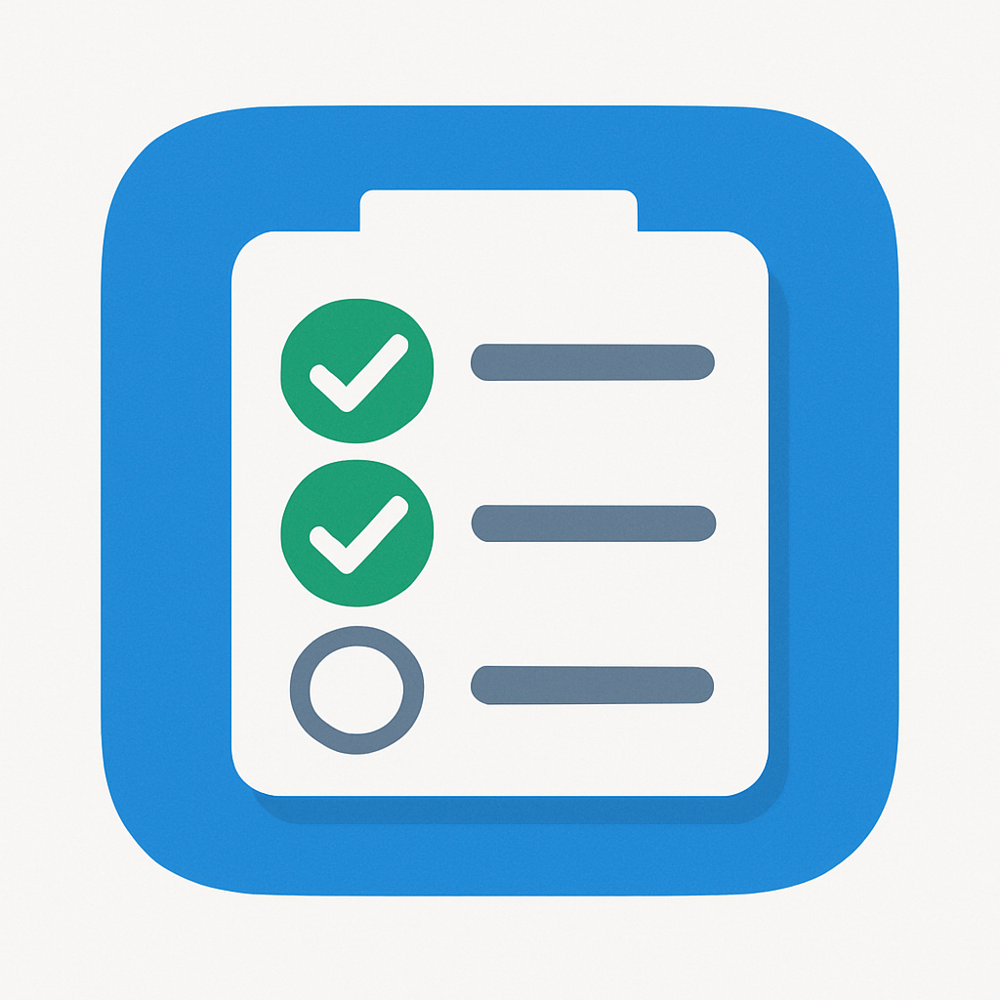

#  TodoList
A simple webapp to build a todolist built in collaboration with chatgpt from open ai.

https://img.shields.io/github/license/parisneo/todolist
## Freatures
- Only frontend. No backend required
- Your data is concerved on your device (no internet backup)
- You can back up your todolist and reload it on another device using json import/export feature
- Fully open source.

There is a live demo of this code in this link.
[Live demo](https://parisneo.github.io/TodoList/)

You can add this to your phone and use it as an app.
